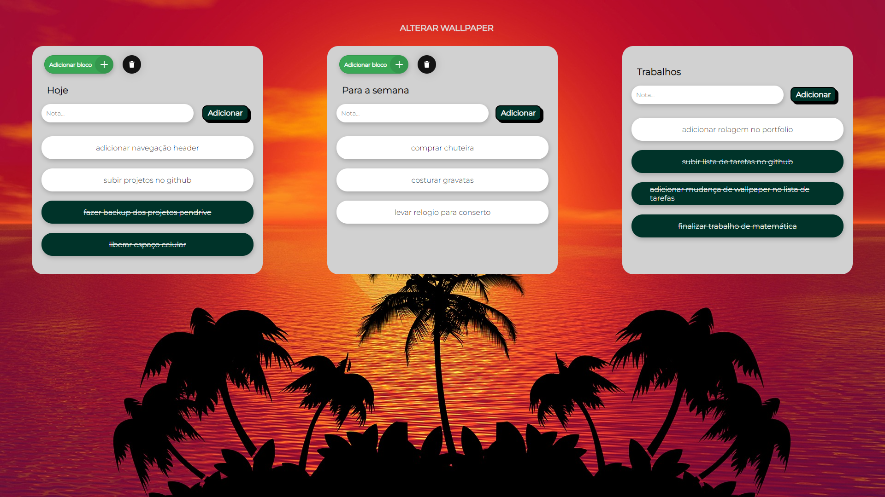

# Lista de tarefas (Português)
Um projeto que é de grande ajuda no meu dia a dia! Uso essa lista de tarefas para organizar minhas metas diárias, o passo a passo de projetos que estou desenvolvendo, compromissos pessoais, entre outras coisas. Usando essa ferramenta, tudo fica mais simples e mais fácil!

Aqui está um exemplo de como eu me organizo através dessa ferramenta:

# Lista de tareas (Español)
Un proyecto que es de gran ayuda en mi día a día! Utilizo esta lista de tareas para organizar mis objetivos diarios, el paso a paso de los proyectos en los que estoy trabajando, los compromisos personales, entre otras cosas. Usar esta herramienta hace que todo sea más simple y fácil!

Aquí va un ejemplo de cómo me organizo con esta herramienta

# To-do list (English)
A project that is a great help in my day-to-day life! I use this to-do list to organize my daily goals, the step-by-step of projects I'm working on, personal appointments, among other things. Using this tool makes everything simpler and easier!

Here's an example of how I organize myself using this tool:

